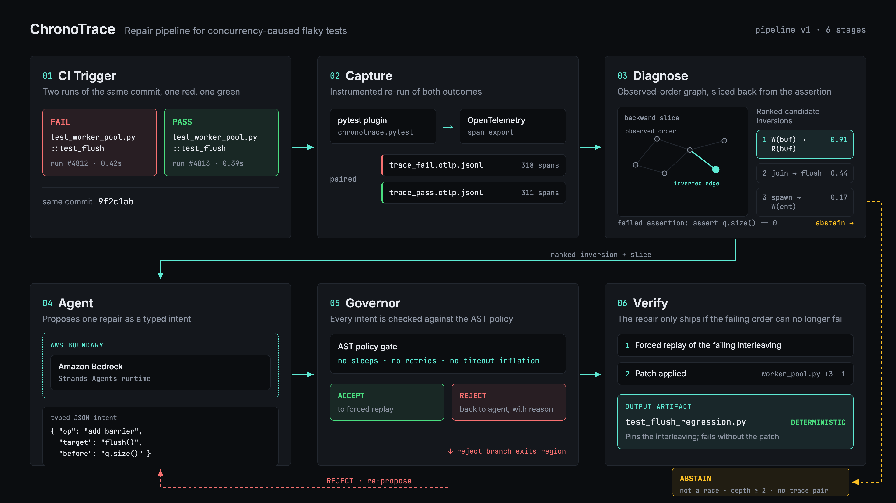
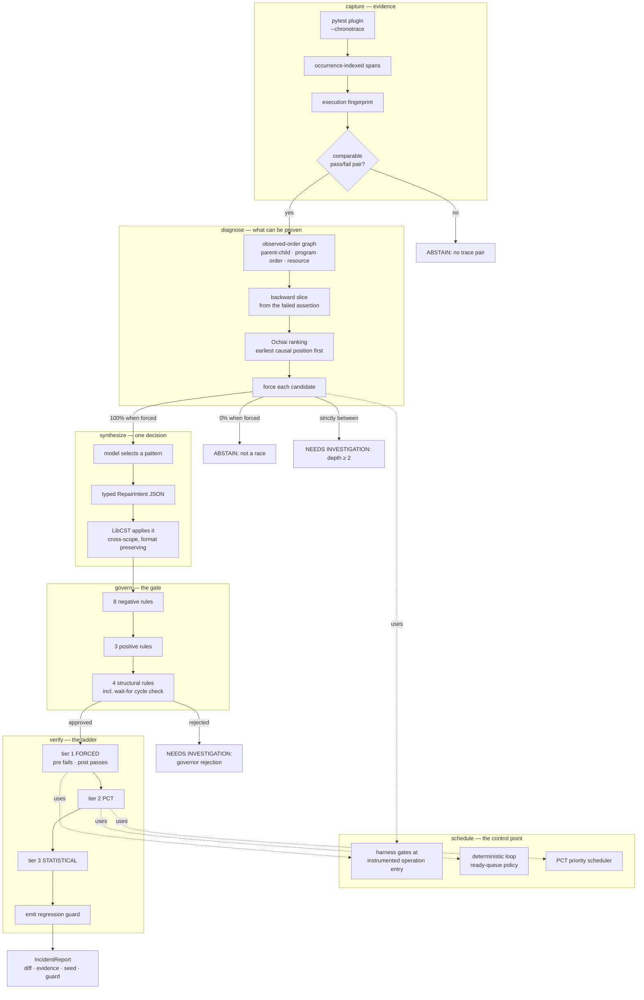

# Architecture

## The shape of the system

## Walkthrough

**capture.** pytest emits no OpenTelemetry spans on its own, so instrumentation
is explicit: `@operation(name, resource=..., access=...)` wraps a coroutine,
records an occurrence-indexed span, and — critically — provides the single point
at which a forced-ordering gate can be applied. Spans are keyed by name *and*
occurrence, because a loop emitting fifty `SELECT` spans must not collapse into
one entry.

Every run carries an execution fingerprint: commit, Python version, dependency
lock hash, container image, test id, environment hash. Traces with different
fingerprints are not comparable and are never diffed. "How do you know the
difference wasn't environmental?" is a question with an answer here.

**diagnose.** The observed-order graph is built from three edge sources —
parent-child nesting, program order within a task, and resource access. It is
called *observed order*, not happens-before: the order is derived from observed
start times plus structural edges, not from a partial order over synchronization
events. Naming it after Lamport while shipping a timestamp sort would be a claim
the implementation has not earned.

Candidates are pruned by a backward slice from the failed assertion, ranked by
Ochiai suspiciousness across all captured traces, and tie-broken by earliest
causal position — ranking by proximity to the assertion biases toward the
symptom rather than the cause.

Then each candidate is **forced**, which turns ranking into a decision:

| Forced failure rate | Meaning | Action |
|---|---|---|
| 100% | sufficient condition | patch it |
| 0% | noise | discard |
| strictly between | necessary but insufficient | report depth ≥ 2, do not patch |
| timed out | ordering unreachable | INFEASIBLE, discard |

**schedule.** asyncio is tractable because tasks yield only at `await`
boundaries and the loop picks the next ready callback. The harness gates entry
to instrumented operations: an operation's gate opens as soon as its predecessor
has *started*, not finished. That distinction is what makes the experiment work
— pre-patch the reader starts and observes stale state; post-patch the reader
starts, blocks on the injected primitive, and the writer is released.

**synthesize.** The model returns a `RepairIntent` and nothing else. LibCST
applies it: the primitive is created in shared scope, `set()` goes into one
coroutine and `await …wait()` into another, after any docstring. A race is
between two coroutines by definition, so a single-function edit would be a
no-op.

**govern.** Fifteen rules, all deterministic, all reported pass or fail so the
whole gauntlet is visible rather than only the rule that fired. Negative rules
resolve names through the module's import table, so `from time import sleep as s`
is caught as a sleep. Rules that need the diff — timeout inflation, weakened
assertions, decollected tests — compare before against after rather than
scanning the result.

**verify.** The ladder above, with the tier reached carried in the result. On
success the module gains a permanent forced-interleaving guard: the race that
appeared once in a few runs now reproduces every run, in milliseconds.

## What runs where

Trace diffing, patching, policy enforcement and verification are all local and
AWS-independent. The agent runs on Bedrock when configured to, and that one
judgement call is the whole of the dependence.

Traces are written as JSONL under `telemetry/` and incidents to SQLite under
`.chronotrace/`. CloudWatch export and a DynamoDB registry would be the right
backends for both — differential analysis needs complete traces, and
probabilistic sampling would destroy the diff — and **neither is implemented**.
Selecting either now raises, rather than silently keeping the local behaviour.
