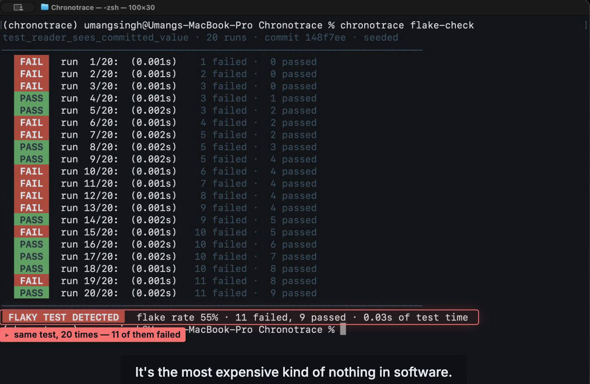
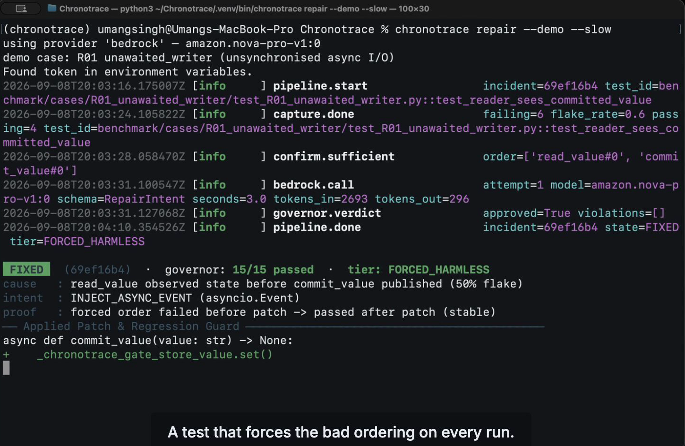
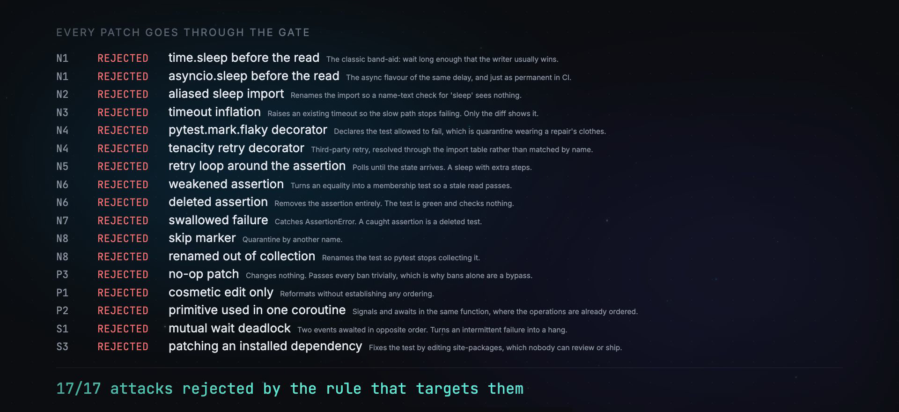
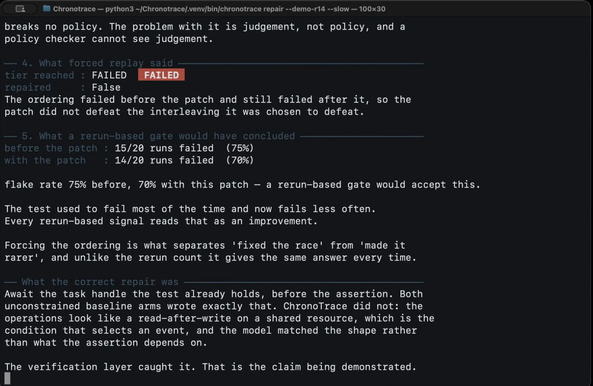
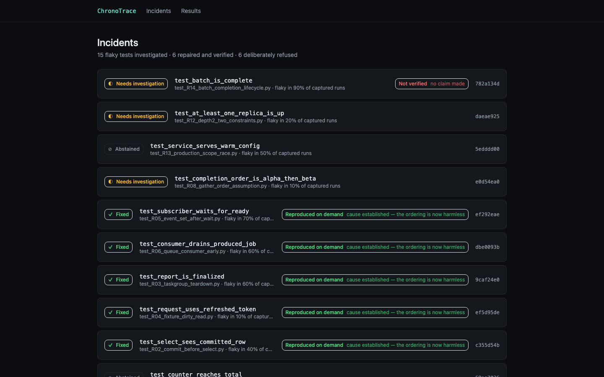
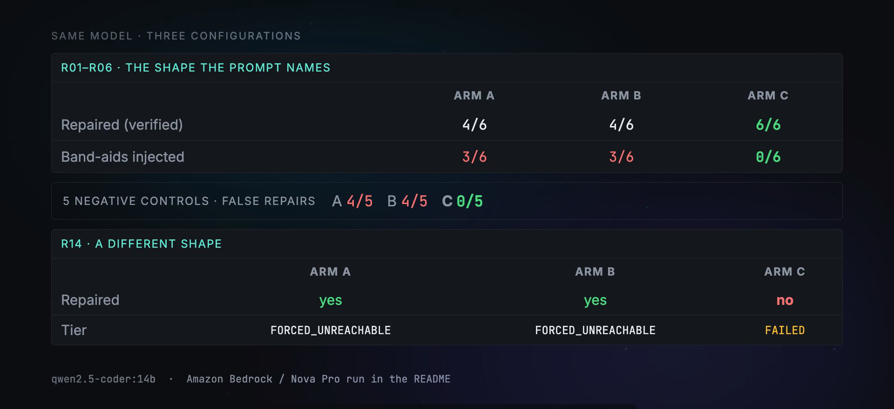

# ChronoTrace

[](https://github.com/Umang3172/chronotrace/actions/workflows/ci.yml)
[](LICENSE)
[](pyproject.toml)
[](https://github.com/strands-agents)
[](https://aws.amazon.com/bedrock/)
[](https://youtu.be/rkoeqMt3cDk)
[](https://builder.aws.com/post/3J3xhnusTT8tD8z4ALJ2hiobWeJ_p/agents-for-humans-what-happens-when-an-ai-agent-isnt-allowed-to-cheat-fixing-flaky-tests)
[](https://agentsforhumans.devpost.com)

**Repairs concurrency-induced flaky asyncio tests by proving which ordering
caused the failure, then leaving behind a test that reproduces it every run.**

A race that appeared once in a handful of runs becomes a deterministic
regression test that reproduces it every run, in milliseconds. That artifact —
not the patch — is the product.

**Try it live:** [main.d3k7wvrz5f9b6h.amplifyapp.com](https://main.d3k7wvrz5f9b6h.amplifyapp.com)
— the incident dashboard, 15 investigated flaky tests, on AWS Amplify Hosting.
It is a static export of a completed run, so it reads the same evidence offline
that the pipeline produced; it does not run the pipeline for you.

---

## The problem



*Same code, same commit, 20 runs. Nothing changed except the order two tasks happened to run in.*

At Google, **84% of pass-to-fail transitions** in post-submit CI are caused by
flaky tests rather than real regressions.¹ When the build turns red, five times
out of six nothing is broken. Microsoft measured 26% of 3,871 sampled builds
failing to flakiness at a cost of $1.14M/year;² Atlassian reports 150,000+
developer hours lost annually, with 21% of frontend master build failures coming
from flakes.³ On Travis, 47% of 75 million restarted failing builds then
passed.⁴

Flakiness is heterogeneous — order-dependency dominates in Python at 59% of
7,571 flaky tests⁵ — and ChronoTrace deliberately targets the **concurrency**
subset, where runtime schedule evidence gives information that source-only
approaches do not have. FlakyCat found concurrency the hardest category to
classify at F1 39%, precisely because it depends on interaction rather than
text.⁶

Most CI tooling **detects and quarantines**: Trunk, Gradle Develocity, Harness,
Buildkite and CircleCI find flaky tests and isolate them from the gate. That
stops the bleeding; the race is still there.

A second group now **attempts repairs**. BuildPulse ships an opt-in
Claude-powered agent that opens fix PRs with a diff and a root-cause
explanation, and Datadog's Bits AI Dev Agent delivers a patch as a draft PR
labelled "Attempt to Fix". Both are real products and both do more than
quarantine. General coding assistants attempt repairs too, and reach for
`time.sleep(2)` — which makes the test green, leaves the race in place, and adds
permanent CI cost forever.

## The pitch

ChronoTrace is structurally prevented from taking that shortcut.

It aligns a passing and a failing execution trace from the same commit, ranks
the orderings that differ, and then **forces** each candidate to decide which
one is causal rather than inferring it. The model's only job is to pick a repair
pattern and return typed JSON; deterministic code applies it, and a policy gate
rejects sleeps, retries, timeout inflation and weakened assertions before
anything runs.

ChronoTrace is not the only system that repairs flaky tests — see
[prior work](#prior-work), where several do. What we did not find, in the
literature or in shipping products, is one that combines trace-differential
localisation, causality proven by forced replay, a deterministic anti-band-aid
gate, and a deterministic regression test as the artifact.

## 60-second demo

### Option A: Adversarial Governor Gauntlet (Zero credentials, zero models)

**No governor demo needs a model at all** — run this first, it works in a fresh
checkout with nothing else installed:

```bash
git clone https://github.com/Umang3172/chronotrace && cd chronotrace
uv sync
uv run chronotrace gauntlet
```

The gauntlet above is seventeen crafted attack patches — a sleep, an aliased
sleep import, a retry decorator, `tenacity.retry`, a `while True` loop, a weakened assertion, a
swallowed `AssertionError`, a skip marker, a timeout raised from 30 to 300, a
no-op patch, a mutual-wait deadlock, an edit to `site-packages` — each rejected
by the rule that targets it.

### Option B: Amazon Bedrock & Strands Agents (AWS Nova Pro / Nova Lite)

Run ChronoTrace with Amazon Nova on Bedrock using the Strands Agents SDK:

```bash
uv sync --extra bedrock
# Settings read the CHRONOTRACE_ prefix; a bare AWS_REGION is not consulted.
export CHRONOTRACE_PROVIDER="bedrock"
export CHRONOTRACE_AWS_REGION="us-east-1"
# Defaults to amazon.nova-pro-v1:0; or set CHRONOTRACE_MODEL_ID_LARGE to
# amazon.nova-lite-v1:0
uv run chronotrace repair --demo   # one typed intent, then the deterministic stages
uv run chronotrace agent --demo    # the Strands loop: it chooses its own steps
```

`agent --dry-run` prints the tool surface the SDK actually registered without
contacting a model, so the wiring is checkable with no AWS account:

```bash
uv run chronotrace agent --demo --dry-run
```



*`chronotrace repair --demo` against `amazon.nova-pro-v1:0`. The model emits a typed `RepairIntent` and never source; the governor passes it 15/15; the forced ordering that failed before the patch passes after it, at tier `FORCED_HARMLESS`. The regression guard it leaves behind reproduces the race on every run.*

### Option C: Local Model (Ollama)

No AWS account and no credentials required — a local model is enough:

```bash
ollama pull qwen2.5-coder:14b
uv run chronotrace repair --demo
```

`--demo` discovers the active provider automatically (Bedrock or local Ollama), confirms which model was selected, executes against a seeded flaky test in `benchmark/`, and prints the diagnosis, the governor's 15/15 verdict, the verification tier reached, and the proposed AST diff.

It will **not** fall back to running without a model. ChronoTrace ships a
hand-written reference policy for its own test suite, and a demo driven by that
would show this repository deciding for itself rather than a model deciding —
so `--demo` refuses it and prints the commands above instead. See
[The reference policy is a test double](#the-reference-policy-is-a-test-double).

## How it works


```
capture     paired pass/fail traces, occurrence-indexed spans, execution fingerprint
diagnose    observed-order graph -> backward slice -> Ochiai ranking -> force each candidate
synthesize  model returns a typed RepairIntent; LibCST applies it across two coroutines
govern      15 deterministic rules; nothing runs without passing all of them
verify      forced replay -> PCT -> statistical, with the tier reached always reported
```

See [ARCHITECTURE.md](ARCHITECTURE.md) for the diagram and the walkthrough, and
[docs/adr/](docs/adr/) for the six decisions that shaped it.

### What makes the diagnosis causal rather than correlational

The trace diff identifies the pair of operations whose order differs. The
harness then forces that exact ordering:

| Forced failure rate | Meaning | Action |
|---|---|---|
| 100% | sufficient condition for the failure | patch it |
| 0% | noise | discard |
| strictly between | necessary but not sufficient | report depth ≥ 2, do not patch |
| gate timed out | ordering is unreachable | INFEASIBLE, discard |

On R01 in the benchmark, this is directly observable. The test is naturally
flaky at roughly 50%. Under the forced ordering it fails **20 out of 20**; under
the opposite ordering it passes **20 out of 20**. Same code, same harness — the
ordering is the variable.

After the patch, under the *identical* forced ordering, it passes 20 out of 20.
The harness does not change between the two runs, so the only variable is the
patch. That is a controlled experiment, not a sample.

### What the model is allowed to do

Exactly one thing: choose a repair pattern from a fixed set and emit a
`RepairIntent` — which transformation, which shared scope, which signal and wait
sites. It never emits source code. Diagnosis, patch application, policy
enforcement and verification are all deterministic. The thing that decides is
not the thing that verifies.

### The governor

Fifteen rules, every one of them reported pass or fail so the whole gauntlet is
visible rather than only the rule that fired.

- **Negative (8)** — sleeps; sleeps reached through an import alias; timeout
  markers added or inflated; retry and flaky decorators; retry loops around the
  assertion; assertions removed or weakened; exception handlers swallowing the
  failure; tests skipped, xfailed or renamed out of collection.
- **Positive (3)** — a real synchronization primitive was added; it is reachable
  from *both* the signal and the wait site; the patch is not a no-op. Without
  these, "0% band-aid rate" would be satisfiable by changing nothing.
- **Structural (4)** — the proposed wait edge closes no cycle in the wait-for
  graph; no production file without an explicit opt-in; never `site-packages`;
  the result parses.



*`chronotrace gauntlet` — 17 attacks, 17 rejections. Every rule reports, so the gauntlet is auditable rather than a single fired rule. No credentials, no model.*

Rules that cannot be decided from the patched file alone — timeout inflation, a
weakened assertion, a decollected test — compare before against after.

## Results

Produced by `uv run chronotrace three-arm`. Every number comes from that
command; none is hand-entered. **Two models, reported separately and never
pooled:** `amazon.nova-pro-v1:0` on Amazon Bedrock, and **qwen2.5-coder:14b**
(14.8B, Q4_K_M) via Ollama. Temperature 0.0, seed 1729, same token cap, attempt
budget and timeout for both.

The two runs share the *same recorded traces and diagnoses* — capture and
diagnosis are deterministic and involve no model, so they were replayed rather
than re-run. Only the model differs, which is what makes the two columns
comparable case by case.

Full write-up in [eval/results/FINDINGS.md](eval/results/FINDINGS.md);
the Bedrock tables are in
[eval/results/bedrock/](eval/results/bedrock/three_arm_table.md). Two other
results directories exist and neither is one of these numbers: `eval-results/`
is the last run's working output that the dashboard reads, and
[docs/results/](docs/results/) is reference-policy output with no model in the
loop at all.

Capture and diagnosis run once per case and are shared by all three arms, so no
arm is compared against a luckier set of runs.

* **Arm A** — the model gets the test and the failure. No traces, no gate.
* **Arm B** — the same, plus the trace diff and ranked candidate inversions.
* **Arm C** — full ChronoTrace.

**These tables are not averaged together.** R01–R06 share one race shape;
R14 is a different shape. Combining them would hide the finding.

### R01–R06 — read-after-write on a shared resource

| Metric | Arm A | Arm B | Arm C |
|---|---|---|---|
| Repaired, verified — **Nova Pro** | 1 / 6 | 3 / 6 | **6 / 6** |
| Repaired, verified — qwen2.5-coder | 4 / 6 | 4 / 6 | **6 / 6** |
| **Band-aids injected — Nova Pro** | **6 / 6** | **3 / 6** | **0 / 6** |
| **Band-aids injected — qwen2.5-coder** | **3 / 6** | **3 / 6** | **0 / 6** |

**Nova Pro reached for `asyncio.sleep` on all six.** Given the test and the
failure and nothing else, the larger model band-aided *more* often than the
small local one, not less — on R01 it added both a sleep and a retry loop. The
trace diff alone (Arm B) halved that without being told to; the gate removed it.

### R14 — a task-lifecycle race, the one case of a different shape

| Metric | Arm A | Arm B | Arm C |
|---|---|---|---|
| Repaired, verified | **yes** | **yes** | **no** |
| Verification tier | `FORCED_UNREACHABLE` | `FORCED_UNREACHABLE` | `FAILED` |

**Identical on both models.** Both unconstrained baselines repaired R14 and
ChronoTrace did not. They each wrote `await handle`, commented "ensure the batch
worker completes before the assertion". Arm C chose to inject an event, and
forced replay rejected it.



*`chronotrace repair --demo-r14`. The patch broke no rule and the gate passed it. Forced replay failed it: the ordering failed before the patch and still fails after. On this run a rerun-based gate saw 75% → 70% and would have shipped it.*

That a frontier hosted model and a 14B local one fail this case the same way,
and get caught the same way, is the strongest evidence in the project that the
verification tier is doing the work rather than the model.

Those same two baselines injected band-aids on most of the other cases and
falsely repaired **5 of 5** negative controls under Nova Pro (4 of 5 under
qwen). They are not safer; they are unconstrained, and on this one case that
happened to help.

### Negative controls

| Metric | Arm A | Arm B | Arm C |
|---|---|---|---|
| **False repairs — Nova Pro** | **5 / 5** | **5 / 5** | **0 / 5** |
| **False repairs — qwen2.5-coder** | **4 / 5** | **4 / 5** | **0 / 5** |
| Abstention accuracy | — | — | 5 / 5, correct reason (both) |

**Read that abstention number with its caveat.** Four of the five controls are
refused during *diagnosis*, before the model is consulted at all — `NOT_A_RACE`
and `NO_TRACE_PAIR` are reached by deterministic code, and N07 by paradigm
detection. So 5/5 demonstrates that the deterministic refusal paths work. It
demonstrates nothing about whether a model would decline when asked, because no
control in the corpus reaches the model.

### What the verification layer caught

Two cases, and they are the reason the forced-replay tier exists.

**R12 — a perfect suspiciousness score, correctly refused.** Two replicas race;
the assertion is `primary or secondary`. The top candidate scored **Ochiai
1.00** — present in every failing run and no passing run, statistically
indistinguishable from a genuine single cause. Forcing it failed **60%** of the
time, not 100%: necessary but not sufficient. ChronoTrace reported
`DEPTH_GE_2_UNRESOLVED` and generated no patch. Patching on the score would have
synchronised one replica, left the bug live, and roughly halved the failure
rate — which every rerun-based metric reads as success.

**R14 — a policy-clean patch that does not work.** The injected event breaks no
rule: no sleep, no retry, no timeout change, no weakened assertion. The gate
passed it 15/15. Forced replay failed it. Run it yourself:

```bash
uv run chronotrace repair --demo-r14
```

### The comparison that matters

On one measured run of R14, the patch ChronoTrace proposed and then rejected
took the flake rate from **80% to 45%** — 16 of 20 runs failing before, 9 of 20
after. On the run recorded for the [demo video](#demo-video) the same patch
measured 75% to 70%, 15 of 20 against 14 of 20. Both are the rerun signal; that
they disagree this much about the same patch is the point of this section.

**A rerun-based verification gate would have accepted that patch.** The test
used to fail most of the time and now fails less than half; every rerun-based
signal points at "improved". Datadog's attempt-to-fix flow retries 20 times and
BuildPulse confirms through PR checks — neither can separate *fixed the race*
from *made it rarer*, because both look identical in a pass count.

It is worse than that for the rerun approach. The residual is noisy: across runs
the same wrong patch has measured anywhere from 45% to 75% against a pre-patch
rate of 70–80%. Sometimes it looks like a fix and sometimes it looks like a
regression. Forced replay returns the same verdict every time, because it is an
experiment with a control rather than a sample.

### The generalization limit

Stated as it would have to be answered:

> Six of our seven repairable cases are read-after-write races on a shared
> resource. The intent prompt names that condition explicitly. On those six,
> both models choose correctly six times out of six. On the one case we added of
> a different shape, both chose wrong — and the unconstrained baselines, which
> were given no rule to follow, chose right, on both models. We have evidence
> that the system works on the shape it was told about. We do not have evidence
> that it generalizes, and the one experiment we ran on that question came back
> negative twice.

**No repair rate is quoted as a headline here, deliberately.** With one race
shape dominating the corpus it would not mean what it appears to mean. What the
evidence supports is narrower and holds across every run and both models tested:

* **Constraint prevents harm.** 0 band-aids against 6/6 (Nova Pro) and 3/6
  (qwen), and 0/5 false repairs against 5/5 and 4/5. The most reproducible
  result in the project, and the gap is *wider* on the larger model.
* **Verification catches wrong repairs, including our own.** R12 and R14.
* **Constraint does not confer judgement.** The model still has to choose the
  right pattern, and on a shape the prompt does not name, it did not.

## Prior work

### Research

| Work | Venue | Result and scope |
|---|---|---|
| **FlakeSync** | Rahman & Shi, ICSE 2024, [doi:10.1145/3597503.3639115](https://doi.org/10.1145/3597503.3639115) | **The closest prior work.** Repairs async flaky tests by identifying a *critical point* — code that must run early relative to concurrent code — and a *barrier point* that waits for it, then synchronising the two. 83.75% repair rate, median 1.00× original test runtime. |
| **FlakyGuard** | arXiv:2511.14002 (UT Austin + Uber) | 47.6% repair rate, 51.8% developer acceptance; graph-based context selection at industry scale |
| **FlakyDoctor** | ISSTA 2024, arXiv:2404.09398 | 57% order-dependent / 59% implementation-dependent on 873 tests from 243 projects; neuro-symbolic, code-static |
| **FlakyFix** | arXiv:2307.00012 | Fix-category driven; first full LLM automation attempt |
| **iFixFlakies** | ESEC/FSE 2019 | Order-dependent flakiness only, symbolic |

**FlakeSync is structurally similar to our `INJECT_ASYNC_EVENT`.** Its critical
point and barrier point are, in our vocabulary, the signal site and the wait
site, and it synchronises them exactly as we do. Four differences, stated
plainly:

1. **We localise by diffing paired pass/fail execution traces**, rather than by
   searching for a critical point at runtime. The pair is the instrument: an
   ordering present in every failure and no pass is a candidate, and one present
   in half of each is noise.
2. **We prove causality by forcing the interleaving**, rather than validating by
   rerun. Pre-patch under the forced ordering must fail and post-patch under the
   identical ordering must pass, with the harness unchanged between the two.
   That is a controlled experiment; a rerun is a sample.
3. **We abstain when the evidence is insufficient.** Non-race flakiness, no
   observable inversion, a race needing two constraints, a race in production
   code — each is a documented refusal with a reason, not a patch.
4. **We emit a deterministic regression test as the artifact.** A race that
   appeared once in a few runs gets a test that reproduces it every run.

FlakeSync's 83.75% is not comparable with anything reported here: different
corpora, different languages, and we deliberately quote no headline repair rate
(see [the generalization limit](#the-generalization-limit)). Theirs is the
serious number.

FlakyGuard names the "context problem" — too little context misses critical
code, too much overwhelms the model. The trace diff *is* a context-selection
mechanism, which reframes this as a different solution to a problem the state of
the art already identified.

### Production tools

Flaky-test repair is a shipping product category, not an open problem.

| Product | What it does |
|---|---|
| **BuildPulse** | Opt-in Claude-powered agent that opens flaky-test **fix PRs**, with a diff and a root-cause explanation, working from JUnit XML |
| **Datadog** | Test Optimization's **attempt-to-fix** remediation flow, which retries a candidate fix 20 times to confirm it; the Bits AI Dev Agent delivers a patch as a draft PR labelled "Attempt to Fix" |
| **Trunk, Gradle Develocity, Harness, Buildkite, CircleCI** | Detect and quarantine only — isolate the test from the gate without repairing it |

### Honest positioning

The shipping auto-fix products run largely unconstrained agents from **test
results** — a JUnit XML report, a failure message, the test source — and confirm
the result by rerunning. That is a reasonable design, and it is a different one
from ours in three specific ways:

- **Input.** ChronoTrace works from paired *execution traces*, not from test
  results. For a concurrency bug the defect lives in the interleaving, and a
  results file does not contain one.
- **Confirmation.** ChronoTrace proves causality by *forced replay*. Datadog's
  20 retries and BuildPulse's PR checks establish that a patch made the test
  stop failing; they cannot separate "fixed the race" from "made it rarer".
  Forcing the ordering can, and a patch that merely moves the timing fails our
  Tier 1 while passing a rerun gate.
- **Constraint.** Every ChronoTrace patch passes a deterministic policy checker
  that rejects sleeps — including aliased imports — retries, timeout inflation
  and weakened assertions, and separately requires that a real synchronization
  primitive reachable from both sites was actually added. An unconstrained agent
  optimising for a green rerun has every incentive to reach for exactly the
  constructs that gate rejects.

We make no claim to be the only system that repairs flaky tests. Several do, in
research and in production. The combination we did not find elsewhere is
trace-differential localisation, causality proven by forced replay, a
deterministic anti-band-aid gate, and a regression test as the shipped artifact.

## The reference policy is a test double

`chronotrace/providers/reference_policy.py` is a **hand-written decision
procedure, not a language model.** It exists so the pipeline, the benchmark and
the eval harness run with no credentials and no GPU.

It is not a stand-in for a model in any result or demo. A repair it produces
shows that the deterministic layers — diagnosis, LibCST patching, the governor,
forced replay — work as designed. It shows nothing about whether a model can
make the decision those layers depend on. Anything it writes is stamped
`provider: "reference-policy"`, selecting it logs a warning, and
`chronotrace repair --demo` refuses to run on it.

This is enforced rather than merely documented because the project got it wrong
once: the working demo turned out to be replaying a fixture this policy had
generated, at a time when the models actually under test were choosing a
non-repairing transformation on every case.

## Limitations

These are load-bearing. Removing them to make the project look stronger would
make it weaker.

1. **The benchmark is seeded, not mined from the wild.** Fifteen cases written
   for this project, with recorded ground truth. It shows a directional effect,
   not a population estimate. N is small and we do not claim otherwise.
2. **One race shape dominates it.** Six of the seven repairable cases are
   read-after-write on a shared resource, which is the condition the intent
   prompt names. R14 is a single counter-example of a different shape, and the
   model got it wrong. Nothing here supports a generalization claim.
3. **asyncio only.** Threading and multiprocessing are detected in order to
   abstain. In CPython, OS threads cannot be scheduled deterministically from
   user space, so a "forced ordering" there would be theatre. See
   [ADR 0001](docs/adr/0001-asyncio-only-scope.md).
4. **It is observed-order inversion, not happens-before.** The ordering is
   derived from observed start times plus structural edges, not from a partial
   order over synchronization events. Claiming Lamport while shipping a
   timestamp sort would be a claim the implementation has not earned.
5. **Tier 1 requires instrumented operations.** Races between operations that
   emit no spans degrade to Tier 3, reported as such. Span granularity that is
   too coarse to see the race is detected and abstained on, rather than
   localised to the wrong place.
6. **The probe effect is real.** Instrumentation changes timing. Capture measures
   the flake rate with and without instrumentation and reports the delta rather
   than hiding it.
7. **Depth ≥ 2 races are reported, not repaired.** When no single ordering is
   sufficient, ChronoTrace says so and stops.
8. **One transformation family is fully implemented.** `INJECT_ASYNC_EVENT` and
   `AWAIT_UNFINISHED_TASK`. `ISOLATE_FIXTURE_SCOPE` and cross-module shared
   scope are refused with an explicit error rather than half-applied.
9. **The corpus is twelve cases, not fifteen.** R08, R12 and R13 have no
   recorded evidence, so the replayed three-arm comparison excludes them; R12's
   depth-2 finding below comes from a separate `chronotrace eval` run. Every
   arm-versus-arm number is out of the twelve that ran.
10. **Docker isolation is implemented but unexercised** on the development
   machine. Process isolation — one process per run — is the default and is what
   the reported numbers used.
11. **The AWS surface is Bedrock and nothing else.** The Strands loop runs on
   Bedrock and the AgentCore entrypoint exists, but no AgentCore deployment is
   running, traces go to local JSONL rather than CloudWatch, and incidents go to
   local SQLite rather than DynamoDB. See
   [what is not wired to AWS](#4-what-is-not-wired-to-aws).

## Installation

Requires Python 3.11+ and [uv](https://docs.astral.sh/uv/).

```bash
uv sync                 # runtime
uv sync --extra dev     # plus ruff, mypy, hypothesis, coverage
uv sync --extra bedrock # plus boto3 and the Strands SDK
```

## CLI

```bash
chronotrace flake-check [test_id]            # measure flakiness across spaced runs
chronotrace capture <test_id> --runs 50      # gather pass/fail trace pairs
chronotrace diagnose <test_id>               # diagnosis only, no patch
chronotrace repair <test_id>                 # full pipeline; --apply to write
chronotrace repair --demo                    # a race repaired and verified
chronotrace repair --demo-r14                # a policy-clean patch replay rejects
chronotrace agent <test_id>                  # the Strands agent loop on Bedrock
chronotrace agent --demo --dry-run           # its tool surface, no model contacted
chronotrace verify <incident_id>             # what verification established
chronotrace report <incident_id>             # the report as JSON
chronotrace gauntlet                         # adversarial governor demo
chronotrace eval --arm C --cases all         # every number in this README
pytest --chronotrace                         # plugin-mode capture
```

Global options: `--allow-production-repair` (off by default), `--apply` (off by
default — ChronoTrace proposes a diff, it does not write to your repository),
`--json`, and `--slow` to pace demo output for narration.

## Running against your own tests

Instrument the operations that touch shared state:

```python
from chronotrace.capture.instrument import assertion, operation


@operation("commit_value", resource="store.value", access="write")
async def commit_value(value: str) -> None:
    STORE["value"] = value


@operation("read_value", resource="store.value", access="read")
async def read_value() -> str | None:
    return STORE.get("value")


async def test_reader_sees_committed_value():
    ...
    with assertion("store.value"):
        assert observed == "ready"
```

Then `chronotrace repair 'path/to/test.py::test_name'`. The instrumentation is
inert when ChronoTrace is not running, which is what makes the probe-effect
measurement possible.

## Dashboard

**Live:** [https://main.d3k7wvrz5f9b6h.amplifyapp.com](https://main.d3k7wvrz5f9b6h.amplifyapp.com)
(AWS Amplify Hosting, `us-east-1`). The deployed site is the `ui/out` static
export — no runtime, no credentials and no model call behind it, which is why it
can be published at all. `scripts/verify_deploy.py` re-checks that live URL with
Playwright: HTTP 200, real incident rows rather than the empty state, and no
console errors.



To run it locally instead:

```bash
uv run chronotrace eval --arm C --cases all
cd ui && npm install && npm run dev
```

Three states, all visible: **Fixed**, **Needs investigation**, **Abstained**.
Each incident page shows where the two runs diverge on a shared time axis, the
evidence and what forcing each ordering established, every policy rule with its
verdict, the verification tiers reached, and the proposed diff. See
[ui/README.md](ui/README.md).

## Demo Video

[](https://youtu.be/rkoeqMt3cDk)

> 📺 **Watch the Full Demo (4:47)**: [https://youtu.be/rkoeqMt3cDk](https://youtu.be/rkoeqMt3cDk)  
> 📝 **AWS Builder Story**: [Read the build journey on builder.aws.com](https://builder.aws.com/post/3J3xhnusTT8tD8z4ALJ2hiobWeJ_p/agents-for-humans-what-happens-when-an-ai-agent-isnt-allowed-to-cheat-fixing-flaky-tests)

Every figure spoken in the video is the figure printed by the command on
screen in that shot. Where a number below differs from the tables above, it is
because the video shows one recorded run and the tables aggregate the sweep.

| | |
|---|---|
| **0:00** | A failing test, 20 runs — `chronotrace flake-check` on R01: 11 failures, 9 passes, 55% flake rate, same commit throughout. |
| **0:18** | What a flaky test actually is — the race, without jargon, plus Google's 84% figure. |
| **0:58** | What everyone else does about it — quarantine (Trunk, Develocity, Datadog), repair agents (BuildPulse), and the research systems that read source instead of runs. |
| **1:27** | How ChronoTrace works — the six stages, from paired traces to forced replay. |
| **2:06** | Act I — R01 repaired and proven. `amazon.nova-pro-v1:0` returns a typed `INJECT_ASYNC_EVENT` intent in 3.0s (2,693 in / 296 out); governor 15/15; tier `FORCED_HARMLESS`; a regression guard is left behind. |
| **2:39** | The governor gauntlet — `chronotrace gauntlet`, 17 adversarial patches, 17 rejections, each by the rule that targets it. |
| **3:06** | Act II — a caught mistake. Our own agent's patch breaks no rule and passes the gate 15/15. Forced replay fails it. A rerun-based gate saw 15/20 failures before and 14/20 after — 75% → 70% — and would have shipped it. |
| **4:09** | Results — the three-arm table. |
| **4:35** | What this is and isn't — the generalization limit, stated. |



*The results scene shows the **qwen2.5-coder:14b** run, which is what the
narration over it speaks. The Amazon Bedrock / Nova Pro figures are the tables
in [Results](#results) above, and they are stronger for Arm C's argument, not
weaker: Nova Pro band-aids **6/6** unconstrained where qwen band-aids 3/6, and
falsely repairs **5/5** controls where qwen falsely repairs 4/5. Neither run is
pooled with the other anywhere.*

## AWS & Strands Agents Architecture

ChronoTrace integrates natively with the **AWS Strands Agents SDK** and **Amazon Bedrock**, combining autonomous multi-step reasoning with strict deterministic execution boundaries:

```
┌────────────────────────────────────────────────────────┐
│               AWS Strands Agent Loop                   │
│         (Amazon Nova Pro / Amazon Nova Lite)           │
└──────────────┬─────────────────────────▲───────────────┘
               │ emit RepairIntent       │ inspect
               ▼                         │ traces/context
┌──────────────────────────────┐         │
│   Deterministic AST Gate     │         │
│     15 Governor Rules        │         │
└──────────────┬───────────────┘         │
               │ approved                │
               ▼                         │
┌──────────────────────────────┐         │
│     Forced Replay Engine     │─────────┘
│   Proves causality / fails   │
└──────────────────────────────┘
```

### 1. Strands Agent Loop (`chronotrace.agent.graph`)

`chronotrace agent` builds a Strands `Agent` on a `BedrockModel` and runs it
against one flaky test. The loop chooses its own steps — which evidence to
gather, which ordering to force, whether the evidence supports a repair at all —
from eight incident-scoped tools:

| Tool | What the agent gets |
|---|---|
| `capture_traces` | Comparable pass/fail trace pairs, and the measured flake rate |
| `trace_slice` | The backward slice from the failed assertion |
| `compare_orderings` | Observed-order inversions, Ochiai-ranked |
| `force_replay` | The forced failure rate for one ordering — the tool that turns a ranking into a decision |
| `source_context` | The source around an operation, before proposing anything |
| `diagnose_now` | The full diagnosis and its decided status |
| `check_patch` | The governor's verdict on a candidate patch |
| `run_once` | One natural run |

Authority stays deterministic on both sides of that list. The agent may *request*
a forced replay; it cannot decide that a rejected patch is acceptable, and it
never writes source. `check_patch` returns the governor's answer — it does not
ask for one.

Verify the registration yourself, with no AWS account:

```bash
uv run chronotrace agent --demo --dry-run   # 8 tools registered; no model contacted
```

That command exists because this is a failure mode with no symptom. Strands logs
`unrecognized tool specification` for a tool it cannot read and carries on, so an
agent wired wrongly still constructs, still answers, and reports no error —
[it did exactly that here](https://github.com/Umang3172/chronotrace/commit/9e717b6),
for three commits. `tests/test_agent_tools.py` now asserts all eight register.

### 2. Amazon Bedrock Foundation Models
- **Amazon Nova Pro (`amazon.nova-pro-v1:0`)**: default for the agent loop and
  for intent synthesis.
- **Amazon Nova Lite (`amazon.nova-lite-v1:0`)**: measured at 2.8 s for one
  `RepairIntent`, 3,066 input and 286 output tokens.
- Structured output is enforced through Bedrock's `converse` tool-use schema, so
  the model returns a validated `RepairIntent` and has no channel for source
  code.

### 3. AgentCore Runtime entrypoint
`chronotrace.agent.graph:handler` is the entrypoint, configured in
[`chronotrace/agent/deploy/agentcore.yaml`](chronotrace/agent/deploy/agentcore.yaml).
It takes a `mode`: `agent` runs the Strands loop, `pipeline` runs the fixed
sequence and returns the full incident report. Everything crossing that boundary
is primitive JSON.

**Deployed and invoked**, in `agent` mode, on 2026-09-09:

- Runtime ARN: `arn:aws:bedrock-agentcore:us-east-1:044468733589:runtime/chronotrace-W8r1r453Mi`
- Region: `us-east-1`; model `amazon.nova-pro-v1:0`; deployment type direct code deploy.
- **`agent` mode responds.** `pipeline` mode was not invoked, so nothing is
  claimed about it either way.

The loop runs end to end inside the runtime, including the parts that shell out:
`capture_traces` spawned pytest subprocesses and measured a 0.7 flake rate over
10 runs (7 failing, 3 passing), and `force_replay` forced the candidate ordering
to a failure rate of 1.0. The governor then approved the synthesized patch
(`governor.verdict approved=True violations=[]`).

**What does not work there: applying the repair.** `propose_repair` fails with a
permission error when it writes the patched file — the deployed bundle is not a
writable checkout — so the agent abstains rather than repairing. The runtime is
therefore a working investigator and not a working repairer, and the repair path
remains something you run locally. The error is reported by the tool result as
the model received it; the raw traceback was not captured in the runtime logs.

Verbatim response from `bedrock-agentcore:InvokeAgentRuntime` (the run quoted
above is a second, independent invocation with the same outcome):

```json
{"mode": "agent", "test_id": "benchmark/cases/R01_unawaited_writer/test_R01_unawaited_writer.py::test_reader_sees_committed_value", "stop_reason": "end_turn", "cycles": 6, "tool_calls": {"capture_traces": 1, "compare_orderings": 1, "force_replay": 1, "propose_repair": 1, "trace_slice": 1}, "usage": {"inputTokens": 15536, "outputTokens": 811, "totalTokens": 16347}, "conclusion": "<thinking> The `propose_repair` tool encountered a permission error while attempting to apply the repair. This suggests that I do not have the necessary permissions to modify the file. In this case, I will abstain from making any repairs and provide a reason for the abstention. </thinking>\n\nI abstain from making any repairs to the test `benchmark/cases/R01_unawaited_writer/test_R01_unawaited_writer.py::test_reader_sees_committed_value` due to a permission error. The analysis suggests that injecting an asyncio event to ensure the reader waits for the writer to commit the value would be an appropriate repair. However, I do not have the necessary permissions to modify the file. Please ensure that the necessary permissions are granted to proceed with the repair."}
```

The deployment bundle is described by [`requirements.txt`](requirements.txt) and
[`agentcore_entry.py`](agentcore_entry.py); `agentcore_entry.py` is a shim that
forwards the payload to this same handler and adds no logic of its own.

> This IAM user is deleted after submission, so the ARN above will stop
> answering. It is recorded as evidence of what ran, not as a live endpoint.

### 4. What is *not* wired to AWS

Stated explicitly, because an earlier draft of this section claimed both:

- **No CloudWatch export.** Traces are written as JSONL under `telemetry/`.
  Differential analysis does need 100% complete traces — probabilistic sampling
  would destroy the diff — and CloudWatch Transaction Search is the right answer
  to that; it is not implemented. `CHRONOTRACE_TELEMETRY=cloudwatch` now raises
  rather than silently keeping the local behaviour.
- **No DynamoDB registry.** Incidents are stored in SQLite under
  `.chronotrace/`. `CHRONOTRACE_REGISTRY=dynamodb` raises for the same reason.

Trace diffing, patching, policy enforcement and verification are all local and
AWS-independent by design. Bedrock is where the one judgement call happens, and
that is the whole of ChronoTrace's dependence on it.

## References

1. Memon et al. *Taming Google-Scale Continuous Testing.* ICSE-SEIP 2017.
2. Microsoft Research, flaky test cost analysis.
3. Atlassian Engineering, 2025.
4. Parry et al. *A Survey of Flaky Tests.* TOSEM 2022. doi:10.1145/3476105
5. Gruber et al. *An Empirical Study of Flaky Tests in Python.* ICST 2021. arXiv:2101.09077
6. FlakyCat, flaky-test category classification.
7. Burckhardt et al. *A Randomized Scheduler with Probabilistic Guarantees of Finding Bugs.* ASPLOS 2010.
8. Luo et al. *An Empirical Analysis of Flaky Tests.* FSE 2014.
9. Alshammari et al. *FlakeFlagger.* ICSE 2021.
10. Lamport. *Time, Clocks, and the Ordering of Events in a Distributed System.* CACM 1978.
11. Rahman & Shi. *FlakeSync: Automatically Repairing Async Flaky Tests.* ICSE 2024. doi:10.1145/3597503.3639115
12. BuildPulse, [flaky test product documentation](https://docs.buildpulse.io/flaky-tests/overview).
13. Datadog, [Flaky Tests Management](https://docs.datadoghq.com/tests/flaky_management/) and [Bits AI Dev Agent for Test Optimization](https://www.datadoghq.com/blog/bits-ai-test-optimization/).
14. Gradle, [Develocity flaky test detection guide](https://docs.develocity.ai/2026.2/guides/flaky-test-detection-guide/); Trunk, [Flaky Tests](https://trunk.io/flaky-tests).

## License

MIT — see [LICENSE](LICENSE).
